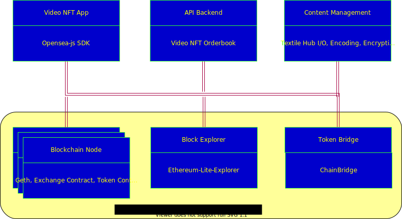

# Video NFT Devnet

## Quick start
checkout the repo, get the submodules and run the docker-compose.
```
git submodule update --init --recursive
docker-compose up
```
Update the docker-compose to lattest vetsion(v1.29.1)  
https://docs.docker.com/compose/install/


Run the command

```
docker-compose up
```

Open the browser and launch the aft-app.
```
http://173.26.0.130/
```

Lightweight block explorer
```
http://173.26.0.140/
```

## Overview of Installer
Docker-compose based devnet that includes the following services:
* Frontend hosting
* API Backend
* Content Management
* Blockchain devnet



## nft-app
VideoCoin NFT Frontend

## Marketplace
This service provides the backend API for the VideoCoin NFT.

Testing the service docker image:

### Obtain TextileHub credentials
https://docs.textile.io/hub/apis/

### Configure Marketplace
Example environment variables file (env.list)
```
MARKETPLACE_TEXTILE_AUTH_KEY=
MARKETPLACE_TEXTILE_AUTH_SECRET=
MARKETPLACE_TEXTILE_THREAD_ID=
MARKETPLACE_TEXTILE_BUCKET_ROOT_KEY=
MARKETPLACE_BLOCKCHAIN_URL=
MARKETPLACE_ERC1155_CONTRACT_ADDRES=0
MARKETPLACE_ERC1155_CONTRACT_KEY=
MARKETPLACE_ERC1155_CONTRACT_KEY_PASS=
```

## Ganache
Test network.

## Explorer
Lightweight Block Explorer

## nft-contracts
Docker image to deploy nft-tokens  
Environment variables file: nft-contracts_env.list
```
VID_RPC="http://ganache:8545"
VID_PRIV_KEY=""
ERC1155_TOKEN_URI_TEMPLATE="http://localhost:3000/tokens/nft1155/{id}.json
```