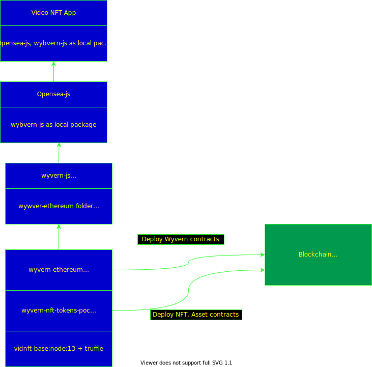

# Video NFT Devnet

Docker-compose based devnet that includes the following services:
* Frontend hosting
* API Backend
* Content Management
* Blockchain devnet


## Frontend

Frontend is created using a layered image as shown below:  


The repo includes the follwoing Opesea SDK pacakges as submodules. These modules are modified during build time of the docker image based on the user configuration.

An example to build the front-end image supplying private key and web3 rpc for deployment of exchange contracts:

Base image containing truffle:
```
cd vidnft-base
docker build -t vidnft-base .
```
```
cd vidnft-front
docker build --build-arg ARG_PRIV_KEY=0xXXXXXXXX --build-arg ARG_RPC=http://localhost:8545 --network="host" -t vidnft-front.
```
This produces an image that contains wywvern-js containing config.json and build folders of wyvern-ethereum with the newly deployed contract addresses, ABI.

### wywvern-ethereum 
The wyvern exchange contracts are installed to the selected blockchain during build-time of the image.
### wyvern-js
The package is updated with deployed wyvern-ethereum contract addresss(config.json) and build folders from the previous layer to this package during build time.

### Opensea-js
The package includes the wyvern-js as a local folder

## Marketplace
This service provides the backend API for the VideoCoin NFT.

Testing the service docker image:

### Obtain TextileHub credentials
https://docs.textile.io/hub/apis/

### Configure Marketplace
Example environment variables file (env.list)
```
MARKETPLACE_TEXTILE_AUTH_KEY=
MARKETPLACE_TEXTILE_AUTH_SECRET=
MARKETPLACE_TEXTILE_THREAD_ID=
MARKETPLACE_TEXTILE_BUCKET_ROOT_KEY=
MARKETPLACE_BLOCKCHAIN_URL=
MARKETPLACE_ERC1155_CONTRACT_ADDRES=0
MARKETPLACE_ERC1155_CONTRACT_KEY=
MARKETPLACE_ERC1155_CONTRACT_KEY_PASS=
```


## Demo steps of the Video NFT Installer
(These are intended steps. Not completed yet)
* Configure the docker-compose.yaml (Owner wallet, Textile Hub Credentials)
* Run the installer. docker-compose up -d
* Create test accounts (User_A, User_B) and fund
* mint a Video NFT using User_A account
  * Inputs: video_file, token_id
  * Outputs: token_URI and encrypted video assets
  * Operation:
    * Upload video_file(Frontend) => Encrypt(CMS) => Upload to Textile Hub
    * Upload thumbnail to Textile Hub(CMS)
    * Upload Token_URI File to Textile Hub(CMS)
    * Mint NFT token with token_id and token_URI(FrontEnd=>Blockchain))
  * Play the video with User_A DRM data(FrontEnd)
* Make SellOrder with User_A account
  * Inputs: Token Contract address, token_Id, ask amount
  * Operation:
    * Add SellOrder (OrderBook)
* Fulfill the order with User_B account
  * Inputs: Token Contract address, token_Id, offer amount
  * Outputs: Updated Token_Uri 
  * Outputs: token_URI and encrypted video assets
  * Operation:
    * Update order(OrderBook)
    * ReEncrypt(CMS) => Upload to Textile Hub
    * Upload Token_URI File to  Textile Hub
    * Transfer NFT token to User_B (Blockchain)
  * Play the video with User_B DRM Data

### User Registration with marketplace

### NFT Minting Sequence Diagram
