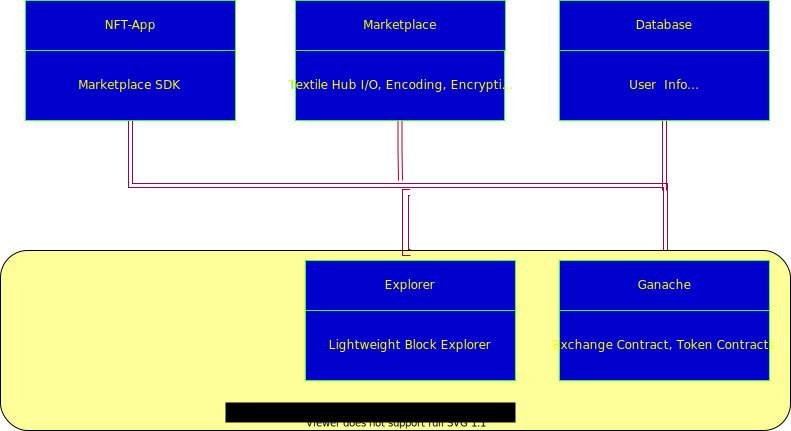

# Video NFT Devnet

Docker-compose based devnet that includes the following services:
* Frontend hosting
* API Backend
* Content Management
* Blockchain devnet



## Frontend

Frontend is created using a layered image as shown below:  


The repo includes the follwoing Opesea SDK pacakges as submodules. These modules are modified during build time of the docker image based on the user configuration.

An example to build the front-end image supplying private key and web3 rpc for deployment of exchange contracts:
```
docker build --build-arg ARG_PRIV_KEY=0xXXXXXXXX --build-arg ARG_RPC=http://localhost:8545 --network="host" -t vidnft-front .
```
This produces an image that contains wywvern-js containing config.json and build folders of wyvern-ethereum with the newly deployed contract addresses, ABI.

### wywvern-ethereum 
The wyvern exchange contracts are installed to the selected blockchain during build-time of the image.
### wyvern-js
The package is updated with deployed wyvern-ethereum contract addresss(config.json) and build folders from the previous layer to this package during build time.

### Opensea-js
The package includes the wyvern-js as a local folder

## API Backend (vidnft-oderbook)
vidnft-oderbook wraps the backend mockup. See the details of the backend in the following repo:    
https://github.com/videocoin/opensea-js-test

## Content Management
-- TODO --

## Blockchain devnet (vcndev)
vcndev sevice includes a 3-node Ethereum PoA network.